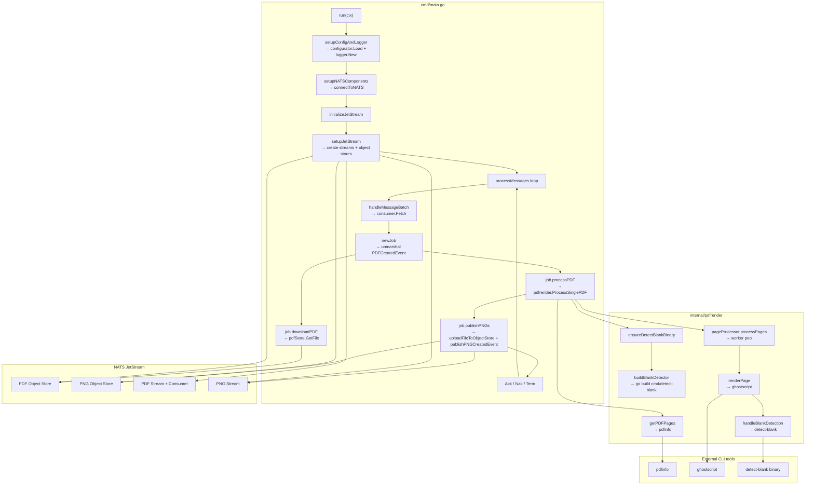

# PDF-to-PNG Service

## Project Summary

A NATS-based microservice that converts PDF files to PNG images.

## Detailed Description

This service listens for `PDFCreatedEvent` messages on a NATS stream. When a message is received, it downloads the PDF file from a NATS object store, converts each page to a PNG image, and uploads the images to another NATS object store. For each generated PNG, it publishes a `PNGCreatedEvent` to a NATS stream.

This service is a key component in the document processing pipeline, enabling subsequent services to work with images instead of PDF files.

Core capabilities include:

-   **NATS Integration**: Seamlessly integrates with NATS for messaging and object storage.
-   **Concurrent Processing**: Utilizes concurrent workers to accelerate the conversion process.
-   **High-Quality Rendering**: Renders each PDF page as a PNG image with configurable DPI using Ghostscript.
-   **Intelligent Blank Page Detection**: Optionally detects and removes blank pages.
-   **Robust Error Handling**: Implements `ack`, `nak`, and `term` logic for handling NATS messages.

## 1.4. Technology Stack

## 1.5. Architecture
Here's a high-level overview of the `pdf-to-png-service` architecture:




-   **Programming Language:** Go 1.25
-   **Messaging:** NATS
-   **Libraries:**
    -   `github.com/nats-io/nats.go`
    -   `github.com/book-expert/configurator`
    -   `github.com/book-expert/events`
    -   `github.com/book-expert/logger`
    -   `github.com/cheggaaa/pb/v3`
    -   `github.com/google/uuid`
    -   `github.com/stretchr/testify`

## Getting Started

### Prerequisites

-   Go 1.25 or later.
-   NATS server with JetStream enabled.
-   Ghostscript (`gs`) installed and available in the system's `PATH`.

### Installation

To build the service, you can use the `make build` command:

```bash
make build
```

This will create the `pdf-to-png-service` binary in the `bin` directory.

### Configuration

The service requires a TOML configuration file to be accessible via a URL specified by the `PROJECT_TOML` environment variable. The configuration file should have the following structure:

```toml
[nats]
url = "nats://localhost:4222"
pdf_stream_name = "pdfs"
pdf_consumer_name = "pdf_processor"
pdf_created_subject = "pdf.created"
pdf_object_store_bucket = "pdf_files"
png_stream_name = "pngs"
png_created_subject = "png.created"
png_object_store_bucket = "png_images"

[paths]
base_logs_dir = "/var/log/pdf-to-png-service"
```

## Usage

To run the service, execute the binary:

```bash
./bin/pdf-to-png-service
```

The service will connect to NATS and start listening for messages.

## Testing

To run the tests for this service, you can use the `make test` command:

```bash
make test
```

## License

Distributed under the MIT License. See the `LICENSE` file for more information.
