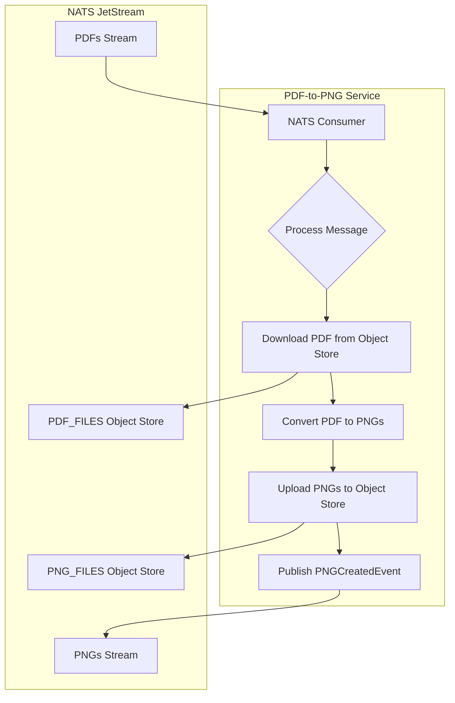

# PDF-to-PNG Service

## Project Summary

A NATS-based microservice that converts PDF files to PNG images.

## Detailed Description

This service listens for `PDFCreatedEvent` messages on a NATS stream. When a message is received, it downloads the PDF file from a NATS object store, converts each page to a PNG image, and uploads the images to another NATS object store. For each generated PNG, it publishes a `PNGCreatedEvent` to a NATS stream.

This service is a key component in the document processing pipeline, enabling subsequent services to work with images instead of PDF files.

Core capabilities include:

-   **NATS Integration**: Seamlessly integrates with NATS for messaging and object storage.
-   **Concurrent Processing**: Utilizes concurrent workers to accelerate the conversion process.
-   **High-Quality Rendering**: Renders each PDF page as a PNG image with configurable DPI using Ghostscript.
-   **Intelligent Blank Page Detection**: Optionally detects and removes blank pages.
-   **Robust Error Handling**: Implements `ack`, `nak`, and `term` logic for handling NATS messages.

## Technology Stack

-   **Programming Language:** Go
-   **Messaging:** NATS JetStream
-   **Libraries:**
    -   `github.com/nats-io/nats.go`
    -   `github.com/book-expert/configurator`
    -   `github.com/book-expert/events`
    -   `github.com/book-expert/logger`
    -   `github.com/google/uuid`
    -   `github.com/stretchr/testify`

## Architecture



## Configuration

The service is configured via a `project.toml` file, loaded by the `configurator` service. The following is an example configuration for the `pdf-to-png-service`:

```toml
[pdf_to_png_service]
dead_letter_subject = "book-expert.pdf-to-png.dlq"

[[pdf_to_png_service.nats.streams]]
name = "PDFS"
subjects = ["book-expert.pdfs.created"]
storage = "file"
retention = "limits"
max_msgs = 10000
max_age = 86400

[[pdf_to_png_service.nats.streams]]
name = "PNGS"
subjects = ["book-expert.pngs.created"]
storage = "file"
retention = "limits"
max_msgs = 50000
max_age = 86400

[[pdf_to_png_service.nats.streams]]
name = "PDF_TO_PNG_DLQ"
subjects = ["book-expert.pdf-to-png.dlq"]
storage = "file"
retention = "limits"

[[pdf_to_png_service.nats.consumers]]
stream_name = "PDFS"
durable_name = "pdf-to-png-durable"
filter_subject = "book-expert.pdfs.created"
ack_policy = "explicit"
max_deliver = 3
max_ack_pending = 20
ack_wait = 300000000000

[[pdf_to_png_service.nats.producers]]
subject = "book-expert.pngs.created"
stream = "PNGS"

[[pdf_to_png_service.nats.object_stores]]
bucket_name = "PDF_FILES"

[[pdf_to_png_service.nats.object_stores]]
bucket_name = "PNG_FILES"
```

## Usage

To run the service, you need to have a NATS server running and the `project.toml` file available at the URL specified by the `PROJECT_TOML` environment variable. Then, you can run the service using the following command:

```bash
make run
```

## Testing

To run the tests for this service, you can use the `make test` command:

```bash
make test
```

## License

Distributed under the MIT License. See the `LICENSE` file for more information.